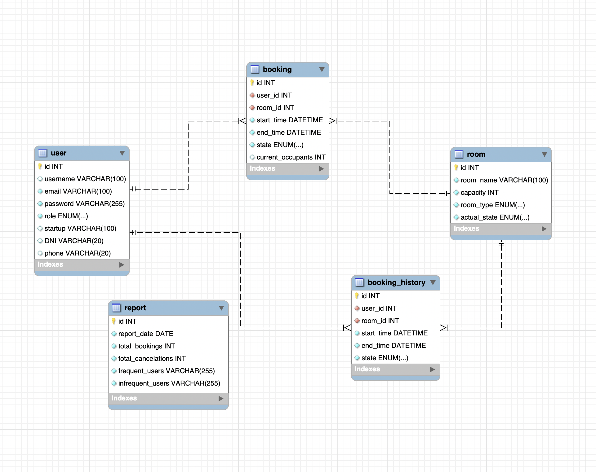

# 🔒 NavDesk - An Access Control Management System 🔒

Welcome to the backend part of NavDesk. This is a Co-Working App project utilizing state-of-the-art technologies to manage access and administration within "Las Naves" facility in Valencia!


<br>

##  <summary> Table of contents 📝</summary>
  <ol>
    <li><a href="#about-the-project-📁">About the project</a></li>
    <li><a href="#deploy-🚀">Deploy</a></li>
    <li><a href="#stack">Stack</a></li>
    <li><a href="#er-diagram-from-sql">ER Diagram from SQL</a></li>
    <li><a href="#local-installation-option">Clone</a></li>
    <li><a href="#endpoints-⚒">Endpoints</a></li>
    <li><a href="#future-functionalities">Future functionalities</a></li>
    <li><a href="#contributions">Contribution</a></li>
    <li><a href="#web-refferences">Web refferences</a></li>
    <li><a href="#development">Development</a></li>
    <li><a href="#appreciations">Appreciation</a></li>
    <li><a href="#contact">Contact</a></li>
  </ol>

## About the project 📁

This project is an efficient implementation of an Access Control System using Node.js, Express, TypeORM, TypeScript and more technologies. It emphasizes robust data handling and seamless access management for StartUp companies who want to create a petition to use a Meeting room or Event room in our building. Through the system, administrators can manage user access to different rooms and track access history efficiently. There is also a possibility to get a detailed report for an enterprise, room or even a person as well as availability view in real time.

More functionalities are on the way!

## Deploy 🚀

<div align="center">
    <a href="https://tattoo-studio.zeabur.app/"><strong> Click here! </strong></a>🚀🚀🚀
</div>

## Stack

Used technologies for the project:

<div align="center">
<a href="https://www.expressjs.com/">
    
</a>
<a href="https://typescriptlang.org">
     
</a>    
<a href="https://nodejs.org/es/">
    
</a>
</a>
<a href="">
    
</a>
<a href="">

</a>
<a href="">
    
</a>
<a href="">
    
</a>
 </div>

## ER Diagram from SQL 📊



- The database schema includes entities like `User`, `Room`, `Access`, `AccessHistory`, and `Administration`. These tables are interconnected to provide a comprehensive system for managing access controls dynamically. The relationships between them provide a faster and more capable way of updating the data in real time environment. It is designed in SQL together with TypeORM.

## Local installation option ⚙️
- Before starting it is important to have SQL and MySQLWorkbench installed locally in order to work with the database. If you dont have it or simply prefer to use a Docker configuration please follow the steps bellow and then you can continue with the clone.
  -1- Create docker SQL Image `docker build -t mssql-app`
  -2- Create a SQL container `docker run -d --name mssql-container -p 3306:3306 mssql-app`
  -3- Run Docker Desktop App and run the container from there

1. Clone the repository from the url
2. `$ npm install` (to get all the node packages)
3. Connect the cloned repo with our Database (if you dont have docker make a mysql container and run it on the wanted port such as:
` docker run -d --name mysqlc -p 3306:3306 -e MYSQL_ROOT_PASSWORD=root  -v mysql_data:/var/lib/mysql mysql `)
4. Change variables in .env with the PORT given from Docker (default is 3306)
5. `$ npm run migrations`
6. `$ npm run db:seed`
7. `$ npm run db:refresh` to execute everything from the beginning
8. `$ npm run dev` to run our server

## 🌐 Endpoints 

### 🔒 Authentication

| Method | URI       | Action         | Auth                | Body                                                                                   |
|--------|-----------|----------------|---------------------|----------------------------------------------------------------------------------------|
| POST   | auth/register  | Register user  | N/A (public)        | `{  "email": "userEmail", "password": "userPassword" }` |
| POST   | auth/login     | Login user     | N/A (public)        | `{ "email": "userEmail", "password": "userPassword" }`                                |

### 👤 Users

| Method | URI           | Action              | Auth      | Body                                                                                   |
|--------|---------------|---------------------|-----------|----------------------------------------------------------------------------------------|
| GET    | /users/all-users        | View all users      | Token (admin) | N/A                                                                                    |
| GET    | /users/{id}   | View user by ID     | Token (admin) | N/A                                                                                    |
| PUT    | /users/{id}   | Update user by ID   | Token (user) | `{ "usernname": "newUserName", "startUp": "newStartUp", "email": "newEmail" }`            |
| DELETE | /users/{id}   | Delete user by ID   | Token (user) | N/A                                                                                    |
| GET    | /users/{id}/current-access       | Display all current accesses of users ID   | Token (user) | N/A                                                                                    |
| GET    | /users/{id}/access-history | View user access histories   | Token (user) | N/A                                                                                    |

### 🏠 Rooms

| Method | URI            | Action              | Auth        | Body                                                                                   |
|--------|----------------|---------------------|-------------|----------------------------------------------------------------------------------------|
| GET    | /rooms/all      | View all rooms   | Token(user) | N/A                                                                                    |
| GET   | /rooms/{id}/current-state     | Display current state of a room      | Token (user) |             |
| GET    | /rooms/{id} | Display room by ID  | Token (user) | N/A                                                                                    |
| PUT    | /rooms/{id} | Update a room by ID | Token (admin) |    name, capacity, type  |
| DELETE | /rooms/{id} | Delete room by ID | Token (admin) | N/A                                                                                    |

### 🗓 Bookings

| Method | URI          | Action             | Auth      | Body                                                |
|--------|--------------|--------------------|-----------|-----------------------------------------------------|
| GET    | /access/room/{id}    | View current room state by ID   | Token (admin) | N/A                                                 |
| POST   | /access/reserve     | Create new booking       | Token (user) | `{ "room_id": "id" }` ,  `{ "date": "YYYY-MM-DD" }`            |
| POST    | /access/check-in/{id} | Check-in to a booking by ID   | Token (user) | N/A                                                 |
| POST    | /access/check-out/{id}| Check-out to a booking by ID  | Token (user) | N/A        |
| DEL | /access/cancel/{id} | Delete a booking by ID| Token (user) | N/A                                                 |

### 🗓 Bookings History

| Method | URI          | Action             | Auth      | Body                                                |
|--------|--------------|--------------------|-----------|-----------------------------------------------------|
| GET    | /history/period   | View all accesses for certain date period   | Token (admin) | `{ "start_date": "YYYY-MM-DD", "end_date": "YYYY-MM-DD"}`                             |
| GET   | /history/room/{id}     | Create order       | Token (admin) | N/A            |

### 📚 REPORTS

| Method | URI          | Action             | Auth      | Body                                                |
|--------|--------------|--------------------|-----------|-----------------------------------------------------|
| POST    | /report/daily | Create a daily report for all bookings  | Token (admin) | N/A                                                 |
| GET   | /report/room-usage/{id}    | Create report for a room by ID       | Token (admin) | N/A     |
| GET    | /report/period | Create a report for specific date period   | Token (admin) | `{"start_date" : "YYYY-MM-DD", "end_date": "YYYY-MM-DD"}`                                                |
| DEL | /report/delete/{id} | Delete a report by ID| Token (admin) | N/A  


## Future functionalities 
<br>
✅ Add reports and details inside <br>
⬜ Add more calendar options <br>
⬜ StartUp and old users validations <br>

## Contribute to the project 📦

Feel free to suggest an improvment or functionality to my project.

There are two ways of doing this:

1. Opening an issue
2. Creating a fork of the repository
   - Creating a new branch
     ```
     $ git checkout -b feature/yourUsername -feat
     ```
   - Make a commit with your changes
     ```
     $ git commit -m 'feat: this X thing'
     ```
   - Make a push to the branch
     ```
     $ git push origin feature/yourUsername -feat
     ```
   - Opening a Pull Request

## Web refferences 📧

To achieve my project I used data from the following sites:

- google.com
- pinterest.com
- spacebring.com
- ...

## Development 📌

```js
const developer = "yoanastamenova";

console.log("Developed by: " + developer);
```

## Contact 📤

<a href = "mailto:yoana.stamenovaa@gmail.com"></a>
<a href="https://www.linkedin.com/in/yoanastamenova" target="_blank"></a>

</p>